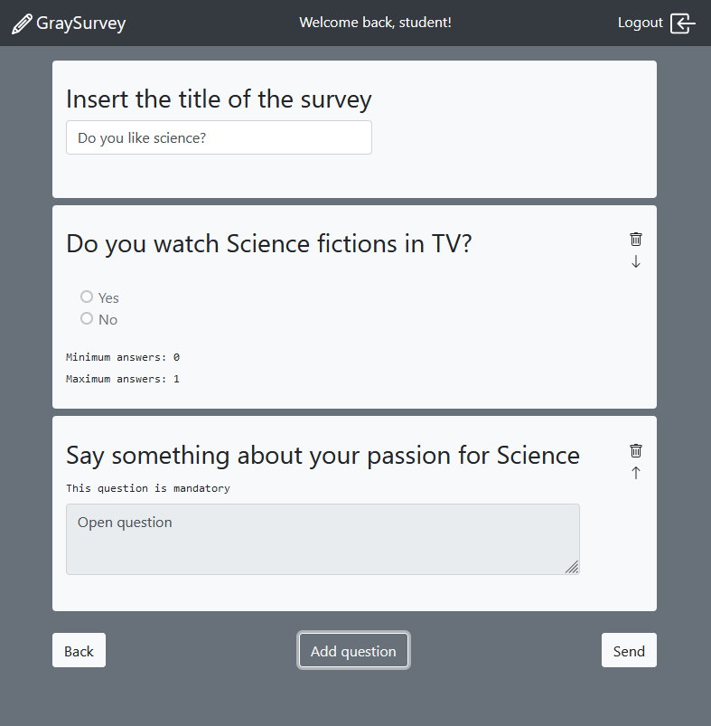

# Exam #1: "Survey"
## Student: s281554 SMORTI MARCO 

## React Client Application Routes

- Route `/`: this route shows all available surveys to unregistered user. If logged in, only administrator's survey are shown
- Route `/login`: route to login by using credentials (email and password)
- Route `/survey/:surveyId`: route to answer a survey. Only unlogged user can access it, otherwise 404 page is shown.
- Route `/admin/new`: route for logged administrators only. It allows the creation of a new survey.
- Route `/admin/survey/:surveyId`: route for logged administrators only. It shows answers to a specific surveyId (only if the owner is the logged user).
- Route `/404`: this route will be shown in case an invalid route is requested.


## API Server

- GET `/api/surveys/all`
  - No parameters and/or body request
  - Gives back a JSON of all available surveys title to unregistered users 
```
[
  {
    "surveyId": 1,
    "title": "How do you move in Turin?"
  },
  {
    "surveyId": 2,
    "title": "How's your Web Applications I exam going?"
  },
  {
    "surveyId": 3,
    "title": "Do you like science?"
  },
  {
    "surveyId": 4,
    "title": "No answers to this survey"
  }
]
```
- GET `/api/surveys/my`
  - No parameters and/or body request
  - Show all available surveys of a logged administrator
```
[
  { surveyId: 1, title: 'How do you move in Turin?', answersNumber: 2 },
  { surveyId: 4, title: 'No answers to this survey', answersNumber: 0 }
]
```

- GET `/api/surveys`
  - Id parameter of the survey to be searched
  - Search a survey through its ID for unregistered users
```
{
  "surveyId": 3,
  "userId": 3,
  "title": "Do you like science?",
  "questions": [
    {
      "questionId": 1,
      "surveyId": 3,
      "title": "Do you watch Science fictions in TV?",
      "min": 0,
      "max": 1,
      "options": [
        {
          "optionId": 1,
          "surveyId": 3,
          "questionId": 1,
          "text": "Yes"
        },
        {
          "optionId": 2,
          "surveyId": 3,
          "questionId": 1,
          "text": "No"
        }
      ]
    },
    {
      "questionId": 2,
      "surveyId": 3,
      "title": "Say something about your passion for Science",
      "mandatory": 1
    }
  ],
  "answersNumber": 1
}
```
- POST `/api/surveys/new`
  - The body contains the title of the survey and the list of questions
  - Add a new survey received from a registered administrator. It gives 200 OK on success, 400 if something is missing, 500 in case of errors.

- POST `/api/surveys/answer`
  - The parameter is the ID of the survey that user is answering. Body contains the name of the user plus the list of answers.
  - Add a new answer received from unregistered user. It gives 200 OK on success, 400 if something is missing, 404 if ID is wrong, 500 in case of errors.

- GET `/api/surveys/get/answers`
  - Id parameter of the answers' survey to be searched
  - Show all available answers of a survey to an administrator. It gives 200 OK on success, 404 if the ID of the survey is not of property of logged administrator, 500 in case of errors.
```
[
  {
    "name": "Carl",
    "answers": [
      {
        "questionId": 1,
        "selOptions": [
          1,
          2
        ]
      },
      {
        "questionId": 2,
        "openAnswer": "I love it!"
      }
    ]
  },
  {
    "name": "Victor",
    "answers": [
      {
        "questionId": 1,
        "selOptions": [
          2
        ]
      },
      {
        "questionId": 2,
        "openAnswer": "I use bus"
      }
    ]
  }
]
```

## Database Tables

- Table `users` - contains `id`, `email`, `name` and `hash` columns of a registered administrator
- Table `surveys` - contains `surveyId` that identifies a survey, `userId` to identify the owner of a survey, `title` of a survey, `answersNumber` number of answers given to that survey, `questions` a JSON column that contains all questions of a survey.
- Table `answers` - contains `answerId` that identifies an answer, `surveyId` to match the answer to a survey, `name` of the user that answered, `answers` a JSON column that contains all answers to a survey.

## Main React Components

- `SurveyNavbar` (in `SurveyNavbar.js`): renders the navbar, welcome message and login/logout buttons based on `loggedIn` state property.
- `LoginForm` (in `LoginForm.js`): renders the login page based on a form put in a `Card` element.
- `AdminContent` (in `AdminContent.js`): if administrator is logged, this component is rendered and makes a call to the API to fetch available surveys of an admin
- `SurveyRow` (in `AdminContent.js`): renders a row of a survey of the logged user by writing title, number of answers to that survey and "See answers" button.
- `UserContent` (in `UserContent.js`): unlogged users renders this page, which makes a call to the API to fetch all available surveys.
- `SurveyRow` (in `UserContent.js`): this object renders the title of a survey which is a link to answer that survey.
- `NotFound` (in `NotFound.js`): this component is rendered everytime something is not found.
- `DoSurvey` (in `DoSurvey.js`): this component gets the list of question of a survey and renders them to be answered. It contains also validation functions and an `handleSubmit` because the survey is rendered as a form.
- `QuestionsList` (in `DoSurvey.js`): renders open and closed questions. It is called for each question of a survey.
- `ErrModal` (in `DoSurvey.js`): this component is rendered only if there is a problem in the validation of the survey.
- `NameBox` (in `DoSurvey.js`): this component is rendered before the showing of the questions and validates the name of the user (only characters, minimum length: 3).
- `ClosedQuestion` (in `DoSurvey.js`): this components renders radio/checkbox form checks and also validates them based on min/max parameters.
- `CreateSurvey` (in `CreateSurvey.js`): this components renders the creation of a survey, based on a form. It shows first the required title of a survey, then renders the button "add questions". When everything is validated, calls an API to send survey to server.
- `AddQuestionModal` (in `CreateSurvey.js`): this components allows the creation of an open/closed question to a survey. It is another form which is validated and then the new question is created and added to the array.
- `ShowAnswers` (in `ShowAnswers.js`): this component calls an API to fetch all answers to a survey. It renders also some button to navigate through the answers' array state. It is similar to `DoSurvey` but all questions are disabled.

## Screenshot



## Users Credentials

| id |      email        |  name   | password    | Surveys                                                    |
| -- | ----------------- | ------- | ----------- | ---------------------------------------------------------- |
|  1 | prova@example.com | admin   |  strong     | _How do you move in Turin? <br> No answers to this survey_ |
|  2 | rob@aol.com       | rob     |  impossible | _How's your Web Applications I exam going?_                |
|  3 | io@polito.it      | student |  polito     | _Do you like science?_                                     |
